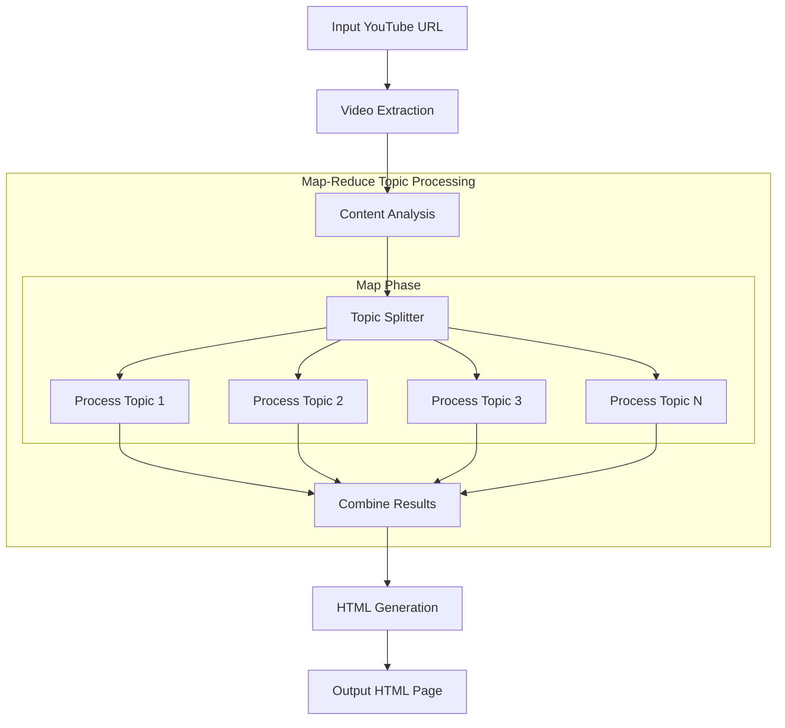

# YouTube Video Summarizer

A Node.js application that summarizes YouTube videos by extracting key topics, generating Q&A pairs, and creating a kid-friendly HTML summary page. Built using PocketFlow architecture with a Map-Reduce pattern for topic processing.

## Features

- Extract video metadata and transcript from any YouTube video
- Identify 5-8 key topics with detailed explanations
- Generate 4-6 comprehensive Q&A pairs for each topic
- Create a visually appealing HTML summary page
- Robust error handling and fallback mechanisms

## Architecture

This application uses a **Map-Reduce** pattern to process YouTube video content efficiently:

1. **Video Extraction**: Fetches metadata and transcript from YouTube videos
2. **Content Analysis**: Identifies 5-8 detailed topics with comprehensive explanations
3. **Topic Processing (Map-Reduce)**:
   - **Map Phase**: Processes each topic independently to generate Q&A pairs
   - **Reduce Phase**: Combines all topic results into a unified structure
4. **HTML Generation**: Creates a visually appealing kid-friendly summary page



## Getting Started

### Prerequisites

- Node.js (v18+)
- OpenAI API Key or compatible LLM API provider

### Setup

```bash
# Clone this repository
git clone https://github.com/ngyngcphu/youtube-summarizer
cd youtube-summarizer

# Install dependencies
npm install

# Create .env file and add your OpenAI API key
cp .env.example .env
# Edit .env with your preferred editor to add API key
```

### Usage

```bash
# Build the project
npm run build

# Run the YouTube summarizer
npm run start
# or for development mode:
npm run dev
```

When prompted, enter a YouTube URL to generate a summary.

## Project Structure

```
youtube-summarizer
├── output/                         # Generated HTML summaries
├── docs/                       
│   └── design.md                   # Design documentation with flow diagram
├── README.md                       # Project documentation
├── package.json                    # Project dependencies and scripts
├── tsup.config.ts                  # TypeScript configuration
├── tsconfig.json                   # TypeScript configuration
├── eslint.config.mjs               # ESLint configuration
└── src
    ├── nodes.ts                    # Node implementations for the flow
    ├── utils                       # Utility functions
    │   ├── callLlm.ts              # LLM API integration
    │   ├── fetchYouTubeVideo.ts    # YouTube video extraction
    │   ├── fileUtils.ts            # File system utilities
    │   └── generateHtml.ts         # HTML output generation
    ├── types.ts                    # Type definitions
    ├── flow.ts                     # Flow configuration
    └── index.ts                    # Main entry point

```

## Map-Reduce Implementation

The YouTube summarizer implements a Map-Reduce pattern for processing topics, providing several benefits:

1. **Isolated Processing**: Each topic is processed independently, ensuring failures in one topic don't affect others
2. **Better Error Handling**: Topic-specific errors are contained and gracefully handled with fallback mechanisms
3. **Increased Detail**: Each topic receives dedicated processing, resulting in more comprehensive Q&A pairs
4. **Enhanced Performance**: Topics are processed in sequence but are logically isolated, creating a foundation for future parallel processing

### Flow Phases:

1. **Map Phase**:
   - The `prepareBatch` method splits incoming topics for individual processing
   - The `processBatchItem` method handles each topic independently
   
2. **Reduce Phase**:
   - The `finalizeBatch` method combines all processed topics back together
   - Handles anomalies, provides statistics, and maintains data consistency

## Environment Variables

Create a `.env` file with the following variables:

```
OPENAI_API_KEY=your_api_key_here
```

## Dependencies

- **pocketflow**: Core framework for the flow-based architecture
- **openai**: API integration for generating content analysis and Q&A pairs
- **youtube-transcript-api**: For fetching video transcripts
- **axios**: For making HTTP requests to external APIs

## License

MIT
