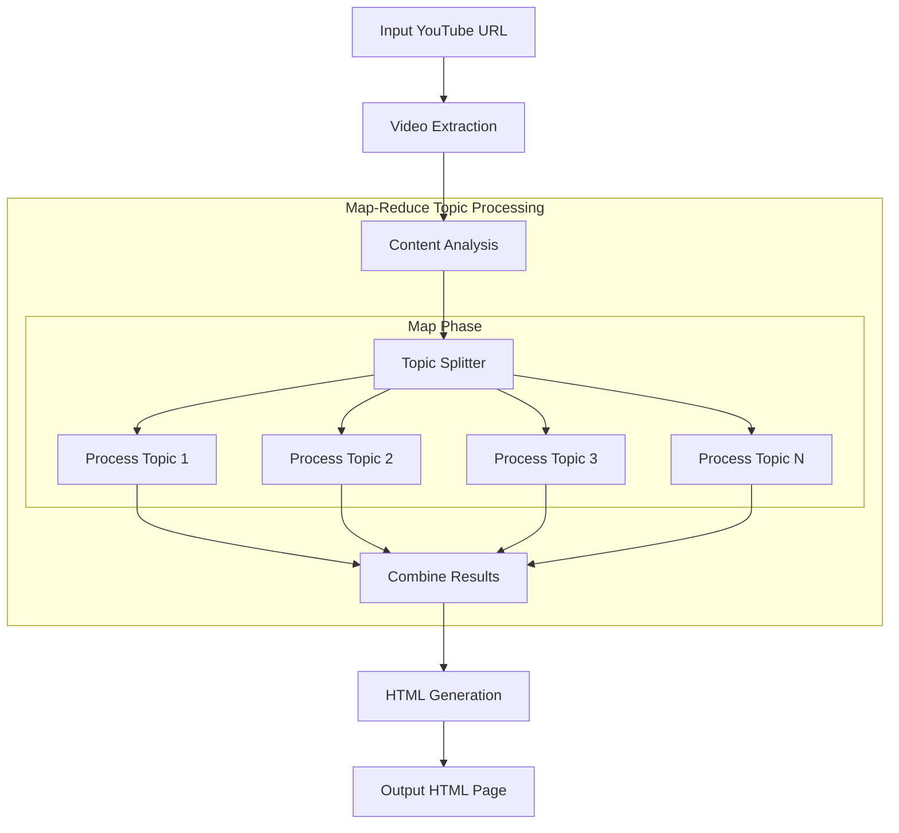

# Design Doc: YouTube Video Summarizer

> Please DON'T remove notes for AI

## Requirements

> Notes for AI: Keep it simple and clear.
> If the requirements are abstract, write concrete user stories

### User Stories

1. As a user, I want to input a YouTube video URL so that I can get a summary without watching the entire video.

2. As a user, I want to see the key topics from the video explained in simple language (appropriate for a 5-year-old) so that I can quickly understand the content.

3. As a user, I want to see questions and answers for each topic so that I can test my understanding.

4. As a user, I want a visually appealing HTML page that displays the video summary in an organized manner.

## Flow Design

> Notes for AI:
>
> 1. Consider the design patterns of agent, map-reduce, rag, and workflow. Apply them if they fit.
> 2. Present a concise, high-level description of the workflow.

### Applicable Design Pattern:

This system uses a **Workflow** pattern with elements of **Map-Reduce**:

1. The workflow processes the video in sequential steps: fetch → analyze → transform → present
2. For content analysis, we use a map-reduce approach:
   - Map: Split the transcript into manageable chunks
   - Reduce: Combine the analyzed chunks into a cohesive summary

### Flow high-level Design:

1. **Video Extraction Node**: Extracts metadata and transcript from YouTube video
2. **Content Analysis Node**: Identifies key topics and generates simplified explanations
3. **Topic Processing Node**: Applies map-reduce pattern to process each topic independently
   - **Map Phase**: Process each topic in parallel to generate Q&As
   - **Reduce Phase**: Combine all topic Q&As into a unified structure
4. **HTML Generation Node**: Produces a visual representation of the summary



### Map-Reduce Pattern Implementation

- **Map Phase**: Each topic is processed independently, allowing for parallel execution and isolated error handling
- **Reduce Phase**: Results from all topics are combined into a cohesive structure
- **Benefits**: Better scalability, isolated failures, and improved performance for larger videos with many topics

### Error Handling & Resilience Strategy

- **Graceful Degradation**: Each node implements fallback mechanisms to handle failures
- **Defensive Programming**: All components validate input data and handle unexpected formats
- **Meaningful Defaults**: Default content is provided when API calls or parsing fails
- **Isolated Failures**: Using the map-reduce pattern ensures that a failure in processing one topic doesn't affect others


## Utility Functions

> Notes for AI:
>
> 1. Understand the utility function definition thoroughly by reviewing the doc.
> 2. Include only the necessary utility functions, based on nodes in the flow.

1. **Fetch YouTube Video** (`src/utils/fetchYouTubeVideo.ts`)

   - _Input_: videoUrl (string)
   - _Output_: { videoId, title, description, transcript, thumbnailUrl }
   - _Necessity_: Used by the Video Extraction Node to retrieve video content

2. **Call LLM** (`src/utils/callLlm.ts`)

   - _Input_: prompt (string), systemPrompt (string)
   - _Output_: response (string)
   - _Necessity_: Used by Content Analysis and Q&A Generation nodes

3. **Generate HTML** (`src/utils/generateHtml.ts`)

   - _Input_: summaryData (object with video metadata, topics, and Q&As)
   - _Output_: HTML string
   - _Necessity_: Used by HTML Generation Node to create visual output

4. **File System Utils** (`src/utils/fileUtils.ts`)
   - _Input_: fileName (string), content (string), directory (string)
   - _Output_: filePath (string)
   - _Necessity_: Used by HTML Generation Node to save output

## Node Design

### Shared Memory

> Notes for AI: Try to minimize data redundancy

The shared memory structure is organized as follows:

```typescript
interface YouTubeSummarySharedStore {
  videoUrl: string;
  videoId: string;
  title: string;
  description: string;
  transcript: string;
  thumbnailUrl: string;
  topics: Array<{
    title: string;
    explanation: string;
    questions: Array<{
      question: string;
      answer: string;
    }>;
  }>;
  outputHtml: string;
  outputPath: string;
}
```

### Node Steps

> Notes for AI: Carefully decide whether to use Batch/Node/Flow.

1. **Video Extraction Node**

- _Purpose_: Extract metadata and transcript from YouTube video
- _Type_: Regular
- _Steps_:
  - _prep_: Read "videoUrl" from the input, validate URL format
  - _exec_: Call fetchYouTubeVideo utility function
  - _post_: Write video metadata and transcript to shared memory
- _Error Handling_:
  - Validates YouTube URL format before processing
  - Provides default metadata if API fails
  - Uses fallback transcript message if captions are unavailable

2. **Content Analysis Node**

- _Purpose_: Identify key topics and generate detailed explanations
- _Type_: Regular
- _Steps_:
  - _prep_: Read "transcript", "title", and "description" from shared memory
  - _exec_: Call callLlm to analyze content and identify detailed topics (5-8 topics)
  - _post_: Write identified topics with comprehensive explanations to shared memory
- _Content Detail Level_:
  - Extracts 5-8 topics instead of 3-5 for more comprehensive coverage
  - Each explanation is 3-5 sentences long with specific examples and key points
  - Maintains simple language while providing richer details
- _Error Handling_:
  - Handles markdown-formatted JSON responses from LLM
  - Uses regex fallback extraction if JSON parsing fails
  - Provides default topics if all extraction methods fail
  - Detects and handles error messages from the LLM API

3. **Topic Processing Node (Map-Reduce)**

- _Purpose_: Process each topic independently to generate comprehensive Q&As using map-reduce pattern
- _Type_: BatchNode (applies map-reduce paradigm)
- _Map Phase_:
  - _batchItems_: Split topics into individual processing units
  - _processBatchItem_: For each topic, call callLlm to generate detailed Q&As (Map operation)
- _Reduce Phase_:
  - _finalizeBatch_: Combine all individual topic results into the final structure (Reduce operation)
- _Content Detail Level_:
  - Generates 4-6 Q&A pairs per topic instead of 2-3 for more comprehensive coverage
  - Includes both basic understanding questions and more thought-provoking questions
  - Answers are 2-4 sentences long with specific examples from the topic
  - Focuses on educational depth while maintaining clarity
- _Error Handling_:
  - Processes each topic independently to isolate failures
  - Handles markdown-formatted JSON responses
  - Uses regex pattern matching to extract Q&As when JSON parsing fails
  - Provides default questions for topics when generation fails
  - Ensures topic-by-topic resilience - failure in one topic doesn't affect others

4. **HTML Generation Node**

- _Purpose_: Create visual HTML summary of the video content
- _Type_: Regular
- _Steps_:
  - _prep_: Read all necessary data from shared memory
  - _exec_: Call generateHtml utility and saveToFile utility
  - _post_: Write "outputHtml" and "outputPath" to shared memory
- _Error Handling_:
  - Validates all input data before generating HTML
  - Uses defensive coding to handle missing or malformed data
  - Provides fallback content when required fields are missing
  - Creates default Q&As when questions aren't available for a topic
